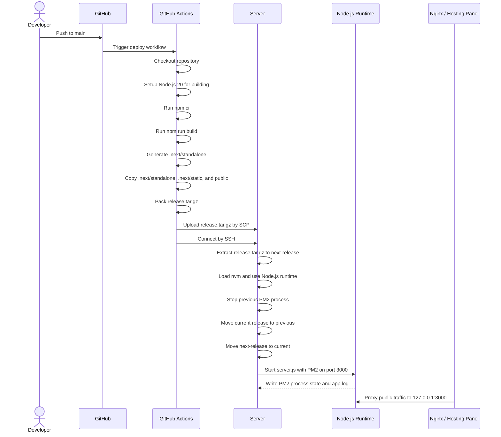

# 0xSnickers Website

Personal website and logbook for 0xSnickers.


## Overview

This repository contains the 0xSnickers personal website, project showcase, and MDX-powered logbook.

The public site is built with Next.js App Router. The `/docs` area is powered by Fumadocs and is used as a daily/technical logbook with categories such as daily notes, frontend, backend, and Solidity.

## Tech Stack

- Next.js 16
- React 19
- TypeScript
- Tailwind CSS v4
- Fumadocs MDX
- Framer Motion
- Lucide React

## Local Development

Install dependencies:

```bash
npm install
```

Start the development server:

```bash
npm run dev
```

Open:

```text
http://localhost:3000
```

Build the production app:

```bash
npm run build
```

The production build uses Next.js standalone output.

## Logbook Content

Fumadocs content lives in:

```text
content/docs/
```

Current top-level logbook categories:

```text
content/docs/daily/
content/docs/frontend/
content/docs/backend/
content/docs/solidity/
```

Add a new MDX page under the relevant category and update that category's `meta.json` to control sidebar ordering.

Example:

```text
content/docs/daily/5-29.mdx
content/docs/daily/meta.json
```

## Deployment

Deployment is handled by GitHub Actions.

The server is intentionally kept as a lightweight runtime host. It does not run `npm ci`, `next build`, or `docker build`.

Deployment flow:



```text
GitHub Actions
  npm ci
  npm run build
  package .next/standalone, .next/static, and public into release.tar.gz
  upload release.tar.gz to the server

Server
  extract release.tar.gz
  switch the current release directory
  run server.js with PM2
```

Required GitHub repository secrets:

```text
SERVER_HOST
SERVER_USER
SSH_PRIVATE_KEY
SERVER_PORT
PROJECT_PATH
```

The server must have Node.js 20 or newer and PM2 available to the SSH deployment user. The current deploy script runs as `root`, loads `/root/.nvm/nvm.sh`, and uses Node.js 26 if available:

```bash
node -v
pm2 -v
```

The app runs on:

```text
0.0.0.0:3000
```

Nginx or the hosting panel should proxy the public domain to:

```text
127.0.0.1:3000
```

The release artifact is packed with this layout:

```text
release/
├── server.js
├── package.json
├── node_modules/
├── public/
└── .next/
    ├── server/
    └── static/
```

Important: `.next/static` must be copied into `release/.next/static` as the contents of the directory, not as a nested `static` folder.

Correct:

```bash
cp -R .next/static/. release/.next/static/
```

Incorrect:

```bash
cp -R .next/static release/.next/static
```

The incorrect form can create `release/.next/static/static/...`, which lets `server.js` start successfully but causes `/_next/static/...` assets to return 404.

After deployment, the server project directory contains:

```text
release.tar.gz
current/
previous/
app.log
```

Useful server commands:

```bash
tail -100 app.log
pm2 status
pm2 logs 0xsnickers-website
pm2 restart 0xsnickers-website
```

## Notes

Docker-based deployment files have been removed to avoid confusion. Production deployment uses standalone build artifacts instead of Docker images. This avoids running heavy Next.js and Fumadocs builds on low-resource servers.

## License

MIT
