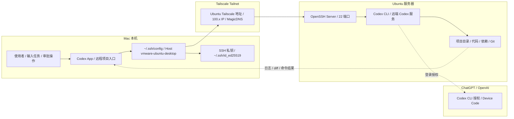

## 文章核心内容

如果你想继续在 Mac 上使用 Codex App 的交互界面，但又希望 **代码、依赖、构建和测试都在远端 Ubuntu 上完成**，最稳的做法就是把 Codex App 接到一个已经可用的 SSH Host 上。

我这次中间加了 **Tailscale**。它的作用不是替代 SSH，而是给 Ubuntu 提供一个稳定地址。这样即使 Ubuntu 跑在 VMware、云服务器或者异地设备上，只要 Mac 能通过 SSH 连到它，Codex 就能继续在远端项目目录里工作。

这套方式适合三类场景：

- 你想把开发环境固定在 Ubuntu，不想在 Mac 本地重复装依赖。
- 你的 Ubuntu IP 不稳定，想用 Tailscale 维持一个更省心的连接入口。
- 你想让 Codex 的命令执行、文件修改和测试结果都留在远端机器上。

最短流程就是这 4 步：

1. 先让 Mac 能通过 SSH 连到 Ubuntu。
2. 再让 Ubuntu 能安装并登录 Codex CLI。
3. 然后把 SSH Host 写进 Mac 的 `~/.ssh/config`。
4. 最后在 Codex App 里选择这个远端项目目录。



## 使用方式

### 正式操作前，先确认 4 件事

开始前先确认下面这 4 项都成立：

- Mac 上已经安装并登录 Codex App。
- Ubuntu 上已经安装 `openssh-server`，并且 SSH 服务可用。
- Mac 和 Ubuntu 已经加入同一个 Tailscale 网络，或者两端本来就能直接互通。
- Ubuntu 可以安装并运行 Codex CLI。

> 如果终端里 `ssh yourusername@100.x.x.x` 都还没打通，先不要打开 Codex App。先修 SSH，后面会省很多时间。

### 最直接的使用入口

如果你只想先把链路跑通一次，按这个顺序做就够了：

1. 在 Ubuntu 上拿到 Tailscale 地址。
2. 在 Mac 上测试 `ssh yourusername@100.x.x.x`。
3. 配好 `~/.ssh/config` 里的 Host Alias。
4. 在 Ubuntu 上安装并登录 Codex CLI。
5. 回到 Codex App，进入 `Settings -> Connections -> SSH`。
6. 创建远程项目，选择 Ubuntu 上的项目目录。

## 怎么实现

### 1. 确认 Ubuntu 在 Tailscale 里在线

先确认 Mac 和 Ubuntu 登录的是同一个 Tailscale 账号，然后在控制台的 Machines 页面里确认两台设备都在线。


在 Ubuntu 上执行：

```bash
tailscale ip -4
tailscale status
```

你会得到一个 `100.x` 地址，例如：

```txt
100.64.12.34
```

后面 SSH 配置里的 `HostName` 就可以先写这个地址。等整条链路跑通后，再换成 MagicDNS 也不迟。

> 第一次配置建议先用 `100.x` 地址。少一层变量，排查会更快。

### 2. 在 Ubuntu 开启 SSH，并先用终端打通

Ubuntu 上安装并启动 SSH：

```bash
sudo apt update
sudo apt install -y openssh-server
sudo systemctl enable --now ssh
sudo systemctl status ssh
```

如果你启用了防火墙，再放行 SSH：

```bash
sudo ufw allow OpenSSH
sudo ufw status
```

然后回到 Mac，直接测试：

```bash
ssh yourusername@100.64.12.34
```

只要这一步还不通，就先不要继续往下配 Codex。因为 Codex 的 SSH 连接，本质上还是复用 OpenSSH。

### 3. 配置 SSH 免密登录和 Host Alias

Codex App 更适合复用已经稳定可用的 SSH 密钥登录。Mac 上如果还没有密钥，可以先生成：

```bash
ssh-keygen -t ed25519 -C "codex@mac"
```

把公钥复制到 Ubuntu：

```bash
ssh-copy-id yourusername@100.64.12.34
```

再次测试：

```bash
ssh yourusername@100.64.12.34
```

如果已经不再要求输入密码，再编辑 Mac 上的 `~/.ssh/config`：

```text
Host vmware-ubuntu-desktop
  HostName 100.64.12.34
  User yourusername
  Port 22
  IdentityFile ~/.ssh/id_ed25519
  IdentitiesOnly yes
  ServerAliveInterval 60
  ServerAliveCountMax 3
```

然后确认 alias 可用：

```bash
ssh vmware-ubuntu-desktop
```

> `Host` 要写成具体名字，不要只写 `Host *`。Codex App 识别的是明确声明出来的 Host。

### 4. 在 Ubuntu 安装 Codex CLI

Codex App 连接到远端后，需要在 Ubuntu 上找到 `codex` 命令，所以这一层不能缺。

先安装基础依赖和 Codex CLI：

```bash
sudo apt update
sudo apt install -y ca-certificates curl git
curl -fsSL https://chatgpt.com/codex/install.sh | sh
```

安装完成后确认：

```bash
which codex
codex --version
codex doctor
```

如果提示找不到 `codex`，通常是 PATH 没带上安装目录，可以把常见目录加入 shell 配置：

```bash
echo 'export PATH="$HOME/.local/bin:$PATH"' >> ~/.bashrc
source ~/.bashrc
```

### 5. 在 ChatGPT 网站开启 device code 登录，再回 Ubuntu 授权

远端 Ubuntu 最稳的登录方式是 device code。关键点在这里：**这个开关要先在 ChatGPT 网站里打开，不是在 Codex App 里打开。**

先用 Mac 浏览器进入 ChatGPT 设置页，开启 Codex CLI 的 device code authorization：


路径大致是：

```text
ChatGPT Settings
  -> Security and login
  -> Enable device code authorization for Codex
```

如果你用的是团队或企业工作区，这个开关可能需要管理员放开权限。

确认网页里的开关已经打开后，再回到 Ubuntu 终端执行：

```bash
codex login --device-auth
```

终端会给出一个链接和一次性 code。用 Mac 浏览器打开链接，登录同一个账号，再输入 code 完成授权。

### 6. 在 Codex App 里启用 SSH 连接

回到 Mac 的 Codex App，进入：

```text
Settings -> Connections -> SSH
```

这时你应该能看到刚才在 `~/.ssh/config` 里写好的 Host。


这里重点看 4 项：

- `主机`：对应 `Host vmware-ubuntu-desktop`。
- `端口`：默认是 `22`。
- `身份文件`：对应 `IdentityFile ~/.ssh/id_ed25519`。
- `允许连接`：需要开启。

如果这里没有出现你的 Host，先回终端确认：

```bash
ssh vmware-ubuntu-desktop
```

### 7. 创建远程项目，并用自检清单确认整条链路

SSH 连接启用后，就可以在 Codex App 里创建远程项目。创建时选择远程，也就是选择已连接计算机上的文件夹。


接下来选择 Ubuntu 上的项目目录，例如：

```text
/home/yourusername/projects/my-app
```

进入项目后，Codex 读写文件、执行命令、安装依赖、运行测试，都会发生在 Ubuntu 上，而不是 Mac 本机。

如果你想快速确认整条链路是否完整，可以按这个顺序自检：

```bash
# Ubuntu 上确认 SSH 正常
sudo systemctl status ssh

# Ubuntu 上确认 Tailscale 在线
tailscale status
tailscale ip -4

# Mac 上确认 SSH alias 可用
ssh vmware-ubuntu-desktop

# Ubuntu 上确认 Codex 可用
which codex
codex --version
codex doctor
```

## 常见问题

### Codex App 找不到 SSH Host

常见原因有两个：

- `~/.ssh/config` 里没有明确写出 Host。
- 终端里 `ssh vmware-ubuntu-desktop` 其实还没打通。

建议先把最小配置写清楚：

```text
Host vmware-ubuntu-desktop
  HostName 100.64.12.34
  User yourusername
  IdentityFile ~/.ssh/id_ed25519
```

然后只做一件事：先在终端里把 `ssh vmware-ubuntu-desktop` 跑通。

### Codex App 连接后提示找不到 codex

这通常不是 Codex App 的问题，而是 Ubuntu 登录 shell 的 PATH 里没有 `codex`。

先执行：

```bash
which codex
echo $PATH
```

如果 `which codex` 没结果，把安装目录写入 `~/.bashrc` 或 `~/.profile`，再重新登录 SSH 会话。

### 远端登录 Codex 一直卡住

优先确认两件事：

- ChatGPT 网站里的 device code authorization 已经打开。
- 你执行的是 `codex login --device-auth`，不是普通网页登录流程。

如果网页开关没开，只在 Ubuntu 终端里反复登录，流程还是可能卡住。

### Tailscale 地址以后会不会变

`100.x` 地址通常比 VMware NAT IP 稳定很多，足够日常使用。如果你想让 SSH 配置更直观，可以在确认链路稳定后改用 MagicDNS 设备名。

### 项目应该放在 Ubuntu 哪里

推荐直接放在 Ubuntu 自己的 ext4 文件系统里，不要依赖 VMware 共享目录。这样依赖安装、文件监听和构建性能通常都会更稳定。
