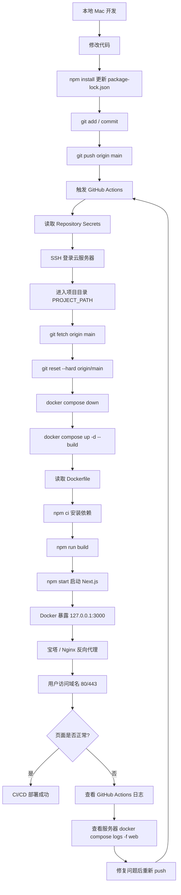

```mermaid
flowchart TD
  A[本地 Mac 开发] --> B[修改代码]
  B --> C[npm install 更新 package-lock.json]
  C --> D[git add / commit]
  D --> E[git push origin main]

  E --> F[触发 GitHub Actions]
  F --> G[读取 Repository Secrets]

  G --> H[SSH 登录云服务器]
  H --> I[进入项目目录 PROJECT_PATH]

  I --> J[git fetch origin main]
  J --> K[git reset --hard origin/main]

  K --> L[docker compose down]
  L --> M[docker compose up -d --build]

  M --> N[读取 Dockerfile]
  N --> O[npm ci 安装依赖]
  O --> P[npm run build]
  P --> Q[npm start 启动 Next.js]

  Q --> R[Docker 暴露 127.0.0.1:3000]
  R --> S[宝塔 / Nginx 反向代理]
  S --> T[用户访问域名 80/443]

  T --> U{页面是否正常?}
  U -->|是| V[CI/CD 部署成功]
  U -->|否| W[查看 GitHub Actions 日志]
  W --> X[查看服务器 docker compose logs -f web]
  X --> Y[修复问题后重新 push]
  Y --> F
  
```